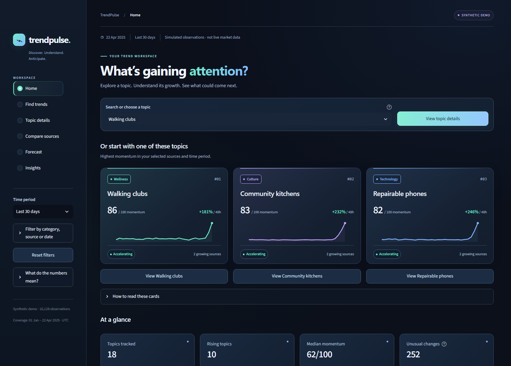

# ◉ TrendPulse

**Internet trend intelligence: spot changing attention, explain the evidence, and test what might happen next.**

TrendPulse is a portfolio analytics project for content strategists, market researchers,
and product teams. Popularity lists favor established topics. TrendPulse instead asks:
*What is accelerating? Is the signal broad or isolated? Has attention already peaked?
Would a forecast outperform simply repeating yesterday?*

The project emphasizes statistics, SQL, data engineering, and transparent decisions.
It has no LLM dependency, scraping, authentication, or cloud services.

**Python · Pandas · NumPy · DuckDB / SQL · scikit-learn · Plotly · Streamlit**

**At a glance:** 18 fictional topics · 2 simulated sources · 16,128 observations ·
7 explainable momentum factors · 1–7 day forecasts · 60 passing tests.

> **Demo, not live market data.** The full app runs without API keys. Real data can
> be imported from authorized local exports; no scraping or live collection is implied.

[Quick start](#quick-start) · [Screenshots](#screenshots) · [Architecture](#architecture) ·
[Dataset and schema](#dataset-and-schema) · [Import real data](#importing-real-data) ·
[Methodology](#analytical-methodology) · [Tests](#test-commands) ·
[Limitations](#limitations-and-next-steps)

## Product

| Workspace | What it answers |
|---|---|
| Home | Which topics are gaining attention, and what merits investigation? |
| Find trends | Which topics have positive, accelerating momentum? |
| Topic details | What drives a score, where are the spikes, and does momentum look durable? |
| Compare sources | Do changes on Reddit precede changes in search interest? |
| Forecast | What might happen over 1–7 days, and how did each model perform out of sample? |
| Insights | Which categories concentrate momentum, and what do the calculated signals imply? |

Shared category, source, time-window, and as-of filters support exploration. Source
filters recompute momentum and lifecycle. Topic details include sentiment, native
source values, score contributions, lifecycle history, anomalies, related attention
patterns, and sustainability evidence. Ranked results can be downloaded as CSV.

### Screenshots



The Aurora interface pairs deep navy surfaces with mint, blue, violet, and amber
accents. Categories keep consistent colors across cards and charts, while trend
stages always include readable text. Subtle card entrances, hover states, and button
feedback use brief CSS transitions; system reduced-motion preferences disable them.
There are no continuous animations, external font downloads, or new runtime services.

The interface starts with searchable topics and clear topic-card
buttons. Topic details are grouped into Summary, Why it's moving, Sources & spikes,
Forecast, and Related topics. Optional filters, comparison charts, and technical
explanations expand when needed. All screenshots show the synthetic demo.

[Signal cards and briefs](docs/screenshots/signals.png) · [Mobile layout](docs/screenshots/mobile.png)

### A simple way to use it

1. On **Home**, type into the topic selector or open one of the suggested topic cards.
2. In **Topic details**, start with Summary; use the other tabs for score components,
   source values, anomalies, 1–7 day forecasts, and related topics.
3. Use **Find trends** to search and rank growing topics, then download the results.
4. Open **Compare sources**, **Forecast**, or **Insights** for a dedicated analysis.
5. Adjust Time period in the sidebar. Expand the other filters only when needed;
   **Reset filters** restores all categories, both sources, and the latest date.

On smaller screens, use **Menu** at the top to open navigation and filters.

The six original workspaces remain available under shorter names: Overview → Home,
Emerging Trends → Find trends, Trend Explorer → Topic details, Cross-Platform Analysis
→ Compare sources, Forecasting → Forecast, and Analytics / Insights → Insights.
Metric help and a sidebar glossary explain the terminology. Technical model
benchmarks, interval assumptions, lifecycle history, SQL, and score components are
preserved behind clearly named tabs or expanders.

## Quick start

```bash
git clone https://github.com/turbzox1/TrendPulse.git
cd TrendPulse
```

If the repository is private, sign in to GitHub with an account that has access.

Run these commands from the project directory. Python 3.11+ is required; the project
was verified with Python 3.14 on Windows. Internet is needed only for package installation.

**Windows PowerShell**

```powershell
python -m venv .venv
.venv\Scripts\python.exe -m pip install -r requirements.txt
.venv\Scripts\python.exe -m src.pipeline --seed 42 --export-demo
.venv\Scripts\python.exe -m streamlit run app/dashboard.py
```

If Windows' `python` command is an App Execution Alias, use an installed interpreter
or the optional uv workflow below.

**macOS / Linux**

```bash
python3 -m venv .venv
.venv/bin/python -m pip install -r requirements.txt
.venv/bin/python -m src.pipeline --seed 42 --export-demo
.venv/bin/python -m streamlit run app/dashboard.py
```

**Optional uv setup (used for verification)**

```powershell
uv venv .venv --python 3.14
uv pip install --python .venv/Scripts/python.exe -r requirements.txt
.venv/Scripts/python.exe -m src.pipeline --seed 42 --export-demo
.venv/Scripts/python.exe -m streamlit run app/dashboard.py
```

Open **http://localhost:8501**. If the default database is absent, the app builds the
demo on first launch. This can take tens of seconds; later runs use cached reads.
No credentials or `.env` file are required. Rebuilding the database invalidates
the cache using its file modification timestamp.

### Security and public deployment

The app binds to `127.0.0.1` by default. CORS and XSRF protection stay enabled;
static file serving and browser exception details are disabled. There is no
authentication: a public deployment exposes its configured dataset to every visitor.
Use only demo or intentionally public data. On a managed HTTPS host, explicitly
override `--server.address 0.0.0.0` if required; do not disable the protections.

`.env.example` documents the optional operator-controlled `TRENDPULSE_DB` setting.
The app does not automatically load `.env` files. Environment variants, Streamlit
secrets, private key files, databases, logs, and generated imports are Git-ignored.
Ignore rules do not remove files already committed to an existing repository.

Imports accept local UTF-8, uncompressed CSV files only (10 MiB each). Manifests
are limited to 256 KiB and 50 topics; exports together are limited to 50 MiB and
100,000 rows. Export paths must resolve inside the manifest directory. URLs,
network shares, absolute manifest export paths, and traversal escapes are rejected.
CSV downloads prefix formula-like text with an apostrophe for spreadsheet safety.

Database paths are trusted operator configuration, not browser input. Load only
databases you created or trust: disabling DuckDB external file access is not a
sandbox for malicious native database files. Dashboard caches are bounded and shared
across visitors; do not use them for private per-user data.

See [the security audit](docs/security-audit.md) for findings and scope. Recheck
dependencies after installation or upgrades (the requirements use version ranges):

```powershell
uv tool run pip-audit --path .venv/Lib/site-packages --format json --output dependency-audit.json
```

On Unix, replace the path with your virtual environment's `lib/pythonX.Y/site-packages`.
This is an optional development check, not an application dependency.

### Test commands

```powershell
.venv/Scripts/python.exe -m pytest -q
.venv/Scripts/python.exe -m compileall -q src app
.venv/Scripts/python.exe -m src.pipeline --help
.venv/Scripts/python.exe tests/smoke_server.py
```

Tests cover deterministic generation, input validation, partial days, past-only
features, score decomposition, all lifecycle rules, zero attention, anomaly
baselines, known propagation lag, constant signals, chronological model selection,
baseline performance, intervals, SQL views, failed-import preservation, all six
Streamlit pages, filters, historical forecast guards, and missing-database states.
Streamlit's `AppTest` executes the application without requiring a browser.

Latest local verification: **60 tests passed**, Python compilation passed, and
the independent Streamlit health and HTML checks returned HTTP 200. See the
[analytics audit](docs/analytics-audit.md) and [security audit](docs/security-audit.md)
for scope, findings, and limitations. These are local verification results, not
a claim that GitHub CI is configured.

### What belongs in the repository?

Source code, tests, SQL, documentation, demo screenshots, and the credential-free
`.env.example` are included. Virtual environments, browser profiles, databases,
generated CSVs, private imports, logs, environment files, and Streamlit secrets are
excluded. Generate the demo locally using the commands above; no large data download
or private credential is needed. Review new files before every future commit—ignore
rules cannot detect secrets embedded in otherwise ordinary source files.

### Troubleshooting

- **The browser did not open:** open [http://localhost:8501](http://localhost:8501)
  on the computer running Streamlit. A GitHub repository is not a hosted application.
- **Port 8501 is occupied:** add `--server.port 8502` to the Streamlit command and
  open `http://localhost:8502`.
- **An old or missing dataset is selected:** unset `TRENDPULSE_DB` to return to the
  demo. Stop the app and rerun `python -m src.pipeline --seed 42 --export-demo`
  with your virtual environment's Python to refresh calculated data.
- **Scores or forecasts are unavailable:** scoring needs roughly three weeks of
  complete history; forecasting requires at least 70 consecutive complete days.
  Missing bins are not silently filled. Check source/date filters and import cadence.
- **No clear leading source:** this is a valid analytical outcome, not an error.
  Both sources need matching cadence and sufficient overlapping variation.

## Architecture

```text
Seeded simulator ─────────────┐
Authorized Reddit CSV ────────┼─→ Validation → Complete daily panel
Official Google Trends CSV ──┘                    │
                        ┌────────────────────────┼────────────────────┐
                        ↓                        ↓                    ↓
               Momentum / lifecycle      Native-bin anomalies   Forecast backtests
                        └────────────────────────┼────────────────────┘
                                                 ↓
                                     DuckDB tables + SQL views
                                                 ↓
                                     Cached Streamlit dashboard
                                    + scoped lead/lag and insights
```

The pipeline constructs a sibling database in a transaction and replaces the
destination only after success. Input failures preserve the previous database.
The dashboard reads and queries analytical data through DuckDB; it recalculates
source-filtered metrics from stored daily panels and lead/lag from stored observations.
Forecasts and benchmarks are persisted. The CLI is the single explicit rebuild path.
Run only one writer per database and stop the app before rebuilding on systems that
lock open database files.

## Dataset and schema

The default generator uses seed **42**, **112 days**, **6-hour bins**, **18 topics**,
and **two simulated sources**, yielding **16,128 observations**. Dates are fixed
from 1 January through 22 April 2025 for reproducibility. These are fictional
measurements, including all sentiment and engagement values. Topic names are
illustrative; they do not establish that a real trend occurred.

Behaviors include logistic organic growth, gradual growth, Gaussian viral spikes,
expired hype, weekly recurrence, and newly emerging growth. Search responses lag
the corresponding underlying Reddit trajectory by 6–24 hours, with independent
noise and diurnal variation. Reddit uses Poisson mentions and engagements; search
uses a bounded index. Archetype labels are not supplied to the analytics or models.

| Table | Grain / purpose |
|---|---|
| `topics` | One topic; ID, name, category, provenance |
| `sources` | One source; name and native unit |
| `observations` | Topic × source × UTC timestamp; native attention and synthetic flag |
| `engagement` | Optional observation-level engagement total |
| `sentiment` | Optional observation-level score from −1 to +1 |
| `daily_attention` | Complete topic-source-day; native attention, past-only reference and relative index |
| `trend_metrics` | Topic-day; momentum components, growth, lifecycle, sustainability evidence |
| `anomalies` | Flagged observation; baseline, difference, percent change, robust z and signals |
| `forecasts` | Topic-source-future-day; forecast, interval, model, fit cutoff |
| `forecast_evaluation` | Topic-source-model; validation and test errors, boundaries and coverage |
| `forecast_errors` | Individual rolling-origin test predictions for auditing |
| `forecast_status` | Topic-source readiness or explicit reason forecasting was skipped |
| `dataset_metadata` | Dataset mode, seed, coverage, count and pipeline version |

Primary and foreign keys protect the core dimensions/facts. Trend metric and
forecast grains have primary keys. `observation_detail` joins optional evidence
without dropping observations. `latest_trends` uses `ROW_NUMBER / QUALIFY`;
`category_summary` aggregates conditional counts; `source_daily_growth` uses an
exact calendar-day self-join so missing days cannot masquerade as two-day changes;
`forecast_comparison` uses window functions to benchmark against last value.

Example SQL:

```sql
SELECT name, category, ROUND(momentum) AS momentum, lifecycle
FROM latest_trends
WHERE growth_rate > 0.08
ORDER BY momentum DESC;

SELECT topic_id, source_id, model, mae, improvement_over_last_value
FROM forecast_comparison
WHERE selected
ORDER BY improvement_over_last_value DESC;
```

## Importing real data

The app defaults to simulation so it is always usable. Real-data ingestion is an
offline, user-supplied export workflow; there is no live collection scheduler or
claim of exhaustive Reddit coverage.

Google provides an [official CSV export workflow](https://support.google.com/trends/answer/4365538?hl=en).
Its [normalization documentation](https://support.google.com/trends/answer/4365533?hl=en)
explains why 0–100 interest is not search volume. Download **daily Interest over time**
in English locale. The adapter handles preamble lines and `<1` as an explicitly
approximate **0.5**. Multiple series require an exact `google_column` choice.
Weekly exports are rejected rather than interpolated into invented daily data.
Use a consistent query, geography, time zone, and export window per topic. Do not
concatenate independently normalized windows without a separate rebasing method.

For Reddit, supply aggregates from data you are authorized to access, following
the [Responsible Builder Policy](https://support.reddithelp.com/hc/en-us/articles/42728983564564-Responsible-Builder-Policy)
and [Data API Terms](https://redditinc.com/policies/data-api-terms). API approval and
access are not assumed. No unofficial endpoints, scraping fallback, or stored
post/user text are used. Do not interpret search-result samples as total mentions.

Reddit CSV contract:

```csv
timestamp,mentions,engagements,sentiment
2025-01-01,25,47,0.18
2025-01-02,31,58,0.22
```

`timestamp` and `mentions` are required. Optional engagement and sentiment remain
missing when absent. Daily rows must represent complete daily observation windows;
6-hour rows must cover UTC 00:00, 06:00, 12:00, and 18:00. A zero means observed zero,
not a failed collection. Sentiment must be supplied by a documented upstream process;
TrendPulse does not infer sentiment from mention counts.

Create a JSON manifest beside the exports:

```json
{
  "topics": [
    {
      "topic_id": "repairable_phones",
      "name": "Repairable phones",
      "category": "Technology",
      "reddit_csv": "reddit.csv",
      "google_csv": "multiTimeline.csv"
    }
  ]
}
```

Either source can be omitted. File paths resolve relative to the manifest. Build
a separate database and select it explicitly:

```powershell
.venv/Scripts/python.exe -m src.pipeline --manifest data/raw/manifest.json --db data/imported.duckdb
$env:TRENDPULSE_DB = "data/imported.duckdb"
.venv/Scripts/python.exe -m streamlit run app/dashboard.py
```

On macOS/Linux, use `export TRENDPULSE_DB=data/imported.duckdb` and the Unix
interpreter path. Remove that environment variable to return to demo mode.
Imported and synthetic data are never silently mixed. Invalid duplicates, negative
attention, unknown sources, and out-of-range search/sentiment values fail validation.

## Analytical methodology

See the [final analytics audit](docs/analytics-audit.md) for the metric dictionary,
corrections, statistical limitations, and interview discussion points.

### Attention and missing data

Reddit daily attention sums mentions. Google daily attention averages its index.
Neither native measures nor engagements are summed across platforms. For each
source, the relative attention index is `100 × attention / prior mean`;
the expanding mean uses **prior days only**, after seven observed days. The combined
chart averages available source indexes with equal weights. This is relative
intensity, not user reach or market share; the reference can adapt over time.

Incomplete days are dropped. Daily rolling features reindex gaps as missing and
require complete windows. There is no interpolation or automatic zero-filling.
Warm-up history before the display window is retained, and as-of filters exclude
later observations from scoring. A zero index reference is unavailable. Displayed
percentage growth uses the actual preceding two-day mean: positive-from-zero is
undefined, zero-to-zero is treated as no change. If a source ratio is unavailable,
the combined percentage is unavailable rather than silently dropping that source.
Small positive baselines can still produce large percentages; they do not establish
market scale. Ranking features, unlike reported percentages, floor the denominator
at one native unit to damp tiny-base noise. Optional engagement totals require all
bins; sentiment is attention-weighted within days and across its two-day window,
and is unavailable with incomplete coverage or zero attention.

### Momentum: an explainable 0–100 score

Compute features separately per source, then average available source factors.
Let the stabilized ranking signal `g` be `(latest two-day mean − preceding two-day mean) / max(preceding mean, 1)`.
Acceleration is `g − g from two days earlier`. Signed transformations use
`B(x,s) = 50 + 50 × tanh(x/s)`; zero movement is neutral (50).

| Factor | Weight | Transformation |
|---|---:|---|
| Attention growth | 25% | B(g, 0.5) |
| Acceleration | 15% | B(change in g, 0.3) |
| Engagement growth | 10% | B(change in engagement per mention, 0.4), denominator floor 0.1 |
| Source diversity | 10% | 100 × number of sources growing >8% / 2 supported sources |
| Persistence | 20% | Share of last 7 days above the historical reference |
| Sentiment movement | 5% | B(two-day sentiment change, 0.2) |
| Novelty | 15% | Positive fraction of recent attention above the historical reference |

The historical reference for persistence and novelty is the prior 28-day mean,
shifted two days, with at least 14 observations. Novelty here means **renewed
attention relative to history**, not proof of a topic's first appearance.
Missing factors are excluded and weights renormalized; the UI shows available
evidence weight. Search has no engagement or sentiment. Single-source filtering
keeps diversity's denominator at two, so it cannot earn full cross-source breadth.
The component points add exactly to momentum. Weights and thresholds are explicit
design assumptions, not optimized to synthetic labels.

### Lifecycle

Classification is recomputed each day from observed behavior. Rules apply in order:

1. Growth below −25%: Fading if attention is below 55% of its trailing peak; otherwise Cooling.
2. Growth below −8%: Cooling.
3. Near peak (≥90%), prior growth >15%, current growth <15%: Peak.
4. Growth >15% and acceleration >3 percentage points: Accelerating.
5. Growth >8%: Emerging.
6. Otherwise: Fading below 45% of peak, Peak otherwise (including a stable plateau).

Rules use stabilized growth. Peak position compares the two-day mean with the
trailing 28-day maximum of two-day means, keeping numerator and denominator
on the same smoothing scale. Classes are descriptive and can skip or revisit stages. They are not
a forced chronological state machine; a plateau can be labeled Peak. No label is
copied from generator archetypes.

### Anomalies and spike explanations

At native cadence, compare each observation with a **preceding** rolling median.
The window is seven days for 6-hour inputs and 14 observations for daily inputs.
Scale is `max(1.4826 × MAD, sqrt(max(median, 1)))`. Flag absolute robust z ≥4.
The scale floor avoids division by zero and excessive flags around tiny baselines.
This is a robust screening statistic, not an exact Gaussian significance test.

Each flag includes timestamp, affected source, signed native-unit magnitude,
baseline, percentage change (missing for zero baseline), direction, robust z, and
co-occurring engagement evidence where available. TrendPulse explains **observed
contributing signals**, not the external event that caused a spike. No news/event
corpus is present. Seasonality, growth regimes, and multiple comparisons can create
false positives; dense flags should be investigated as episodes.

### Propagation and related topics

Cross-correlate first differences of `log1p(attention)` across ±8 native bins.
Positive lag means Reddit precedes search; negative means search precedes Reddit.
Require 40 aligned changes, no gap interpolation, and nonconstant series. Differencing
reduces correlations caused solely by shared upward levels.

A 49-draw seeded circular-shift null preserves serial structure and evaluates the
maximum correlation across tested lags. The UI only describes a propagation signal
when r ≥0.25 and exploratory p ≤0.10. This small-sample, lag-adjusted screen is not
corrected across topics, and does not establish causation. Shared events, periodicity,
sampling, and window choice can affect the result. Related topics use pairwise
positive correlations of daily index changes with at least 21 overlaps, not semantic
matching. Calendar gaps are not bridged when differencing. Mixed source cadences
return an explicit unavailable result: daily exports cannot establish six-hour leads.

### Forecasts and leakage control

Forecast **native daily attention**, independently per topic/source; this avoids
using full-history normalization in a historical backtest. Three candidates:

- Last value: repeat the latest observation.
- Seasonal naive: repeat the prior week's corresponding day.
- Ridge autoregression: lags 1, 2, 7, trailing 7-day mean, and 7-day slope;
  standardized features with fixed alpha 10, fitted using past rows only.

Seven-step forecasts are recursive. Nonnegative bounds apply to all models;
Google outputs are also capped at 100, in both backtests and future predictions.
No random train/test split or future covariates are used.

With n ≥70 consecutive daily values, the last 42 days form three **disjoint 14-day
blocks**: validation, calibration, and final test. Earlier data are initial training.
Each block has two non-overlapping seven-day forecast origins, refitting on the
history available at that origin. Choose the model on validation MAE only; estimate
the nominal 80% interval radius from 14 absolute calibration residuals (higher
empirical quantile, pooled horizons); report MAE and RMSE on final test for every
candidate and interval coverage for the selected model. Test observations can
enter the second test origin's training history only after they would have arrived.

Final forecasts refit on all observations. Historical dashboard views hide them
to prevent displaying a future-fitted model as if it existed at an earlier date.
Intervals are small-sample empirical estimates and may undercover during regime
changes. They are not separately calibrated by horizon or distribution-free
guarantees for these dependent time series. Gaps or short history yield an explicit
unavailable status; the app does not fabricate a forecast.

### Sustainability / hype assessment

A transparent evidence index combines persistence (30%), inverse weekly coefficient
of variation (15%), engagement per mention (15%, scaled and capped at 2), growing
source breadth (15%), repeated above-reference attention over 21 days (15%), and
bounded acceleration (10%). Missing quality/repetition use a neutral 0.5 and reduce
the separately reported sustainability evidence coverage by their respective weights.

Score ≥65 with positive growth → Sustainable; score <40 or growth below −25% →
Short-lived; otherwise Uncertain. Confidence is **Medium** only for a non-Uncertain
label with ≥85% sustainability evidence coverage, observed engagement quality, and
two growing sources; otherwise **Low**. Growth gates use stabilized growth. These are heuristic
confidence labels, not calibrated event probabilities. No claim of supervised
predictive validity is made for this assessment.

### Deterministic insights and decisions

Insights are sentence templates populated from calculated metrics, not generated
claims. For example, the UI reports a topic's measured 48-hour change, momentum,
number of growing sources, and lifecycle. The propagation view names a source
lead only when its evidence gate passes. Run the demo to obtain exact seeded values.

Verified default-demo examples (seed 42, both sources, 22 April 2025):

> Walking clubs: 48-hour change +181% (two-day mean versus preceding two days),
> with momentum 86/100. 2 source(s) exceed 8% stabilized growth; lifecycle:
> accelerating. Scored as of 2025-04-22.

> Community kitchens: 48-hour change +232% (two-day mean versus preceding two days),
> with momentum 83/100. 2 source(s) exceed 8% stabilized growth; lifecycle:
> accelerating. Scored as of 2025-04-22.

Of the 36 simulated forecast series, validation selects ridge for 26, seasonal
naive for 6, and last value for 4. This is a demonstration result, not proof that
ridge will outperform on real data; the final test errors remain visible per series.

Practical uses include prioritizing research on broad, persistent growth, timing
content experiments before a peak, and flagging cooling hype for cautious campaign
planning. An insight is a lead to investigate; especially in demo mode, it is not
a recommendation based on actual market behavior.

## Project structure

```text
TrendPulse/
├── app/dashboard.py          # Six Streamlit views and interactive Plotly charts
├── data/README.md            # Provenance; generated DB/CSV files are ignored
├── src/
│   ├── ingestion/            # Seeded generator and authorized export adapters
│   ├── processing/           # Input validation and complete-day transformation
│   ├── analytics/            # Momentum, lifecycle, anomalies, lead/lag, insights
│   ├── models/               # Ridge, baselines and chronological evaluation
│   ├── database/             # Schema, views and transactional storage
│   └── pipeline.py           # Reproducible CLI orchestration
├── tests/                    # Analytics, data, SQL and application smoke tests
├── .streamlit/config.toml    # Dark theme
├── requirements.txt
├── pyproject.toml
├── PLAN.md
└── README.md
```

## Limitations and next steps

The simulator demonstrates engineering and analytical behavior, not accuracy on
real internet trends. Gaussian spikes and shared latent curves are intentionally
simplified. No demographics, unique-user reach, bot filtering, topic entity
resolution, or causal attribution are available. Data acquisition is export-based;
collection coverage and source provenance need independent assessment. Real
sentiment measurement and engagement definitions may differ across providers.

Next improvements: authorized scheduled ingestion with coverage audits; anchored
Google export rebasing; richer multi-week rolling-origin evaluations; seasonal
residual anomaly detection and episode grouping; lag stability across windows;
external-event annotations with cited evidence; and sustainability calibration
against prospectively defined real outcomes. These should follow validation on
real data before adding model complexity.
